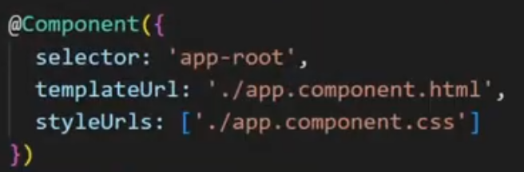
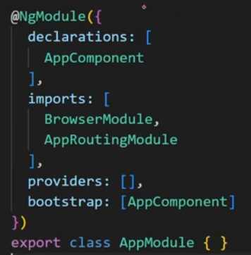

# Angular

### Contents

1. [Angular Framework](https://github.com/RukshanDias/Angular#1-angular-framework) </br>
2. [Components & Modules](https://github.com/RukshanDias/Angular#2-components--modules) </br>
3. [Data Binding](https://github.com/RukshanDias/Angular#3-data-binding) </br>

---

## 1. Angular Framework

#### 1.1 What is Angular?

-   A component based framework for building structured, scalable and SPA for client side.

#### 1.2 What are Angular advantages?

-   Component based architecture.
-   Cross platform & open source.
-   Reuseable code (services).

#### 1.3 Angular vs AngularJs?


#### 1.4 What's NPM?

-   Node Package Management. manage open source packages that can be used in project.

#### 1.5 What's CLI tool?

-   Command line interface that use to initialize & develop Angular apps.
-   Can create components, services, modules, etc.
-   Wll automatically register the created elements also.

---

## 2. Components & Modules

#### 2.1 What're Components?

-   Basic UI building block of an Angular app.
-   Normally there are 4 files in a Angular component.
    -   CSS - Styling file. Can also be scss, sass
    -   HTML - template file.
    -   TS - file that link all the component files.
    -   spec.ts - unit test file.

#### 2.2 What's Selector & Template?



-   selector is used to identify each component uniquely.
-   Template is the HTML view of the component.

#### 2.3 What's a Module?

-   A place where you can group the components, directives, pipes and services which are related to the component.
    
-   **declarations** - components that the module can have.
-   **imports** - use services of other modules.
-   **providers** - _related to dependency injection_
-   **bootstrap** - which component will be bootstrapped out of declared components.

#### 2.4 How Angular app gets loaded?

1. **index.html** - Single page of the app. index.html will invoke main.js which is the JS version of Main.ts.
2. **Main.ts** - Entry point of webapp. It bootstraps the AppModule ro run on the browser.
3. **app.module.ts** - AppModule wii bootstrap AppComponent.
4. **App-component** - Final View. All other components get here.

#### 2.5 What's Bootstrapped Module & Component?

-   When Angular app starts, the first module/component to launch is the bootstrapped one. (in short - 1st to launch).

---

## 3. Data Binding

#### 3.1 What's data binding

-   A way to communicate between TS code and html view.
-   

#### 3.2 What's string interpolation

-   One-way data-binding technique, transfer data from TS to HTML
    -   Only works with strings.
    -   represented inside {{ }}

```
let title="hello"; //ts

<h1> {{ title }} </h1> //html
```

#### 3.3 What's property binding

-   superset of interpolation - support all data types

```
let isDisabled=true; //ts

<input type='text' [disabled]='isDisabled'/> //html
```

#### 3.4 What's Event Binding

-   Used to handel events raised by user actions. i.e : btn click.
-   transfer from html to ts.

```
<button (click)="clickBtn()"> Click Me </button> //html

public clickBtn(){ console.log("clicked")} //ts
```

#### 3.5 What's 2 way data binding?

-   Support html to ts and ts to html same time.

```
<input [(ngModel)]="name" type="text"/> //html
<h1> {{ name }} </h1>   // real time output of change

let name="Mike"; //ts

```

---

## 4. Directives

#### 4.1 What're directives? & there types?

-   Directives are, classes that add additional behavior to elements.
-   3 types of main directives. Can create customs also.
    1. **Component**: directives with its own templates. shows 1st view.
    2. **Attribute**: change appearance & behavior of element.
        - [ngStyle]
        - [ngClass]
    3. **Structural**: change the appearance of DOM. by adding & removing.
        - \*ngIf
        - \*ngFor
        - \*ngSwitch
-   

#### 4.2 What's \*ngIf?

-   follows the if condition.

```
<h1 *ngIf="dataVisible"> Hello </h1>

let dataVisible = false;    //ts
```

#### 4.3 What's \*ngFor?

-   follows the For loop principle.

```
<li *ngFor="let student of studentList">
    {{ student }}
</li>

let studentList = ['Jane', 'May', 'Peter']  //ts
```

#### 4.4 What's \*ngSwitch?

-   follows the Switch case principle.

```
<ul [ngSwitch]="studentList.length">
    <li *ngSwitchCase=0> 0 students </li>
    <li *ngSwitchCase=1> 1 students </li>
    <li *ngSwitchCase=2> 2 students </li>
    <li *ngSwitchDefault> More students </li>
</ul>

let studentList = ['Jane', 'May']  //ts
```

#### What's [ngStyle]

-   Update Style for html element.

```
<div [ngStyle]="{'color': myColorName}"></div>

let myColorName = 'red';
```

#### What's [ngClass]

-   Adds & removes CSS classes from an element.
