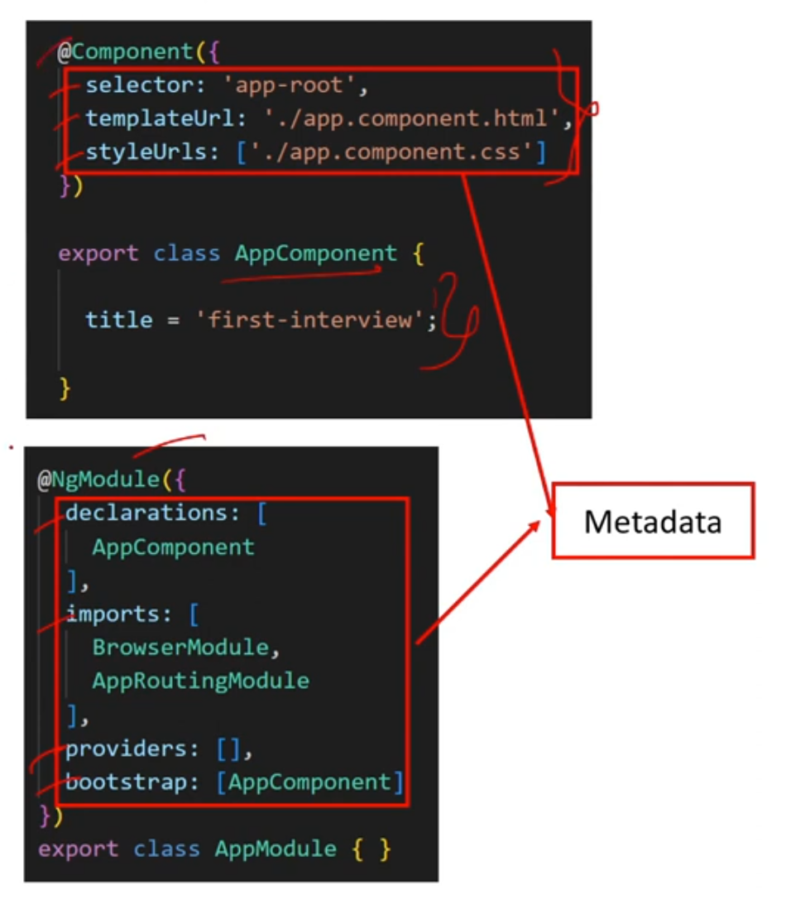

# Angular

### Contents

1. [Angular Framework](https://github.com/RukshanDias/Angular#1-angular-framework) </br>
2. [Components & Modules](https://github.com/RukshanDias/Angular#2-components--modules) </br>
3. [Data Binding](https://github.com/RukshanDias/Angular#3-data-binding) </br>
4. [Directives](https://github.com/RukshanDias/Angular#4-directives) </br>
5. [Decorator & Pipes](https://github.com/RukshanDias/Angular#5-decorator--pipes) </br>
6. [Services & Dependency Injection](https://github.com/RukshanDias/Angular#6-services--dependency-injection) </br>
7. [Lifecycle Hooks](https://github.com/RukshanDias/Angular#7-lifecycle-hooks) </br>
8. [Observable / HttpClient/ RxJS](https://github.com/RukshanDias/Angular#8-observable--httpclient-rxjs) </br>
9. [Typescript Basics](https://github.com/RukshanDias/Angular#9-typescript-basics) </br>

---

## 1. Angular Framework

#### 1.1 What is Angular?

-   A component based framework for building structured, scalable and SPA for client side.

#### 1.2 What are Angular advantages?

-   Component based architecture.
-   Cross platform & open source.
-   Reuseable code (services).

#### 1.3 Angular vs AngularJs?


#### 1.4 What's NPM?

-   Node Package Management. manage open source packages that can be used in project.

#### 1.5 What's CLI tool?

-   Command line interface that use to initialize & develop Angular apps.
-   Can create components, services, modules, etc.
-   Wll automatically register the created elements also.

---

## 2. Components & Modules

#### 2.1 What're Components?

-   Basic UI building block of an Angular app.
-   Normally there are 4 files in a Angular component.
    -   CSS - Styling file. Can also be scss, sass
    -   HTML - template file.
    -   TS - file that link all the component files.
    -   spec.ts - unit test file.

#### 2.2 What's Selector & Template?


-   selector is used to identify each component uniquely.
-   Template is the HTML view of the component.

#### 2.3 What's a Module?

-   A place where you can group the components, directives, pipes and services which are related to the component.
    
-   **declarations** - components that the module can have.
-   **imports** - use services of other modules.
-   **providers** - _related to dependency injection_
-   **bootstrap** - which component will be bootstrapped out of declared components.

#### 2.4 How Angular app gets loaded?

1. **index.html** - Single page of the app. index.html will invoke main.js which is the JS version of Main.ts.
2. **Main.ts** - Entry point of webapp. It bootstraps the AppModule ro run on the browser.
3. **app.module.ts** - AppModule wii bootstrap AppComponent.
4. **App-component** - Final View. All other components get here.

#### 2.5 What's Bootstrapped Module & Component?

-   When Angular app starts, the first module/component to launch is the bootstrapped one. (in short - 1st to launch).

---

## 3. Data Binding

#### 3.1 What's data binding

-   A way to communicate between TS code and html view.
-   

#### 3.2 What's string interpolation

-   One-way data-binding technique, transfer data from TS to HTML
    -   Only works with strings.
    -   represented inside {{ }}

```
let title="hello"; //ts

<h1> {{ title }} </h1> //html
```

#### 3.3 What's property binding

-   superset of interpolation - support all data types

```
let isDisabled=true; //ts

<input type='text' [disabled]='isDisabled'/> //html
```

#### 3.4 What's Event Binding

-   Used to handel events raised by user actions. i.e : btn click.
-   transfer from html to ts.

```
<button (click)="clickBtn()"> Click Me </button> //html

public clickBtn(){ console.log("clicked")} //ts
```

#### 3.5 What's 2 way data binding?

-   Support html to ts and ts to html same time.

```
<input [(ngModel)]="name" type="text"/> //html
<h1> {{ name }} </h1>   // real time output of change

let name="Mike"; //ts

```

---

## 4. Directives

#### 4.1 What're directives? & there types?

-   Directives are, classes that add additional behavior to elements.
-   3 types of main directives. Can create customs also.
    1. **Component**: directives with its own templates. shows 1st view.
    2. **Attribute**: change appearance & behavior of element.
        - [ngStyle]
        - [ngClass]
    3. **Structural**: change the appearance of DOM. by adding & removing.
        - \*ngIf
        - \*ngFor
        - \*ngSwitch
-   

#### 4.2 What's \*ngIf?

-   follows the if condition.

```
<h1 *ngIf="dataVisible"> Hello </h1>

let dataVisible = false;    //ts
```

#### 4.3 What's \*ngFor?

-   follows the For loop principle.

```
<li *ngFor="let student of studentList">
    {{ student }}
</li>

let studentList = ['Jane', 'May', 'Peter']  //ts
```

#### 4.4 What's \*ngSwitch?

-   follows the Switch case principle.

```
<ul [ngSwitch]="studentList.length">
    <li *ngSwitchCase=0> 0 students </li>
    <li *ngSwitchCase=1> 1 students </li>
    <li *ngSwitchCase=2> 2 students </li>
    <li *ngSwitchDefault> More students </li>
</ul>

let studentList = ['Jane', 'May']  //ts
```

#### 4.5 What's [ngStyle]

-   Update Style for html element.

```
<div [ngStyle]="{'color': myColorName}"></div>

let myColorName = 'red';
```

#### 4.6 What's [ngClass]

-   Adds & removes CSS classes from an element.

---

## 5. Decorator & Pipes

#### 5.1 What's Decorator?

-   decorator store metadata about a class, method or property.
-   All decorators are represented with @ symbol.
-   

#### 5.2 What're the types of decorators?


##### 5.2.1 Class Decorator

-   @Component - marks a class as a component & provide metadata
-   @NgModule - marks a class as a NgModule & provide metadata

##### 5.2.2 Property Decorator [(View)](https://www.youtube.com/watch?v=I317BhehZKM&t=176s)

-   @Input:

    -   Parent => Child
    -   marks a class field as input property. - Will reflect in the DOM, 'ng-reflect-InputName'

    ```
    // template
    <parent>
        <child [exampleProperty]="Data">
        </child>
    </parent>

    // Parent
    Data = "Hello world";

    // Child
    @Input
    exampleProperty: string;
    // exampleProperty: string = "Hi"; <- means, the default val is "Hi";
    ```

-   @Output

    -   Child => Parent

    ```
    // template
    <parent>
        <child [messageEvent]="receiveMsg($event)"></child>
    </parent>

    // parent
    receiveMsg($event){
        this.msg = $event;
    }

    // child
    @Output
    messageEvent = new EventEmitter<string>();

    this.messageEvent.emit("Sending msg..")
    ```

#### 5.3 What're Pipes?

-   A function that accept an input & return a transformed value.
-   

```
<h3> {{ title }} </h3>                  // Hello World
<h3> {{ title | lowercase }} </h3>      // hello world
<h3> {{ title | uppercase }} </h3>      // HELLO WORLD

```

-   **Parameterized pipe** - pipes with parameters passed.

```
{{ 123.45 | currency }}         // USD currency
{{ 123.45 | currency: 'LKR' }}  // SL currency
```

#### 5.4 What's chaining pipes?

-   A use of multiple pipes on data.

```
{{ dob | date | uppercase }}    // converting to date format, & then uppercase
```

---

## 6. Services & Dependency Injection

#### 6.1 What's Service?

-   A TS class & a reuseable code which can be used in multiple components.
-   Can be implemented with the help of Dependency Injection.
-   
-   in above example, instead of coding 'ErrorLogging' twice can create a service and pass a single instance trough the component.

#### 6.2 Creating a service

-   Using the CLI

```
ng generate service service-name
```

-   Use dependency injection when inserting service into a component.
-   <u>Using a service in a component.</u>

```
// step 01: import
import {LogginService} from 'src/services/logging-service';

// step 02: declaring in providers
providers: [LoggingService]

// step 03: pass service in constructor
constructor{
    private logginService: LoggingService
} { }


// step 04: using service
constructor{
    private logginService: LoggingService
} {
    this.logginService.LogError();
 }

```

#### 6.3 What's Hierarchical Dependency Injection?

-   Hierarchical Dependency Injection is, when you inject a service to a Node it'll be only accessible to itself & it's children. It won't be accessible for parent & siblings.
-   
-   So no need to provide the service in 'Providers' for accessible child components. But still have to pass it to the constructor.

-   **3 places** where you can declare the provider.
    1. component level: define what service
        ```
        providers: [LoggingService]
        ```
    2. in Module: define what service
        ```
        providers: [LoggingService]
        ```
    3. @Injectable in service :- define where to provide.
        ```
        @Injectable({
            provideIn: 'root'
        })
        ```

#### 6.4 What's a Provider?

-   An obj declared inside decorator, which inform that the specific service is available for injecting.
-   

#### 6.5 The role of @Injectable ?

-   One service can be used by another service.
-   @Injectable decorator should placed in both services.

---

## 7. Lifecycle Hooks

#### 7.1 What're lifecycle hooks?

-   The different stages a component goes through.
    1. constructor:
    2. ngOnChanges
    3. ngOnInit
    4. ngDoCheck
    5. Child components
    6. ngOnDestroy
-   

#### 7.2 What's a constructor?

-   a method in a TS class, that gets automatically called when class being instantiated.
-   Not part of lifecycle. Run before lifecycle Hooks.
-   Used to **inject dependencies(services)** into the component.

#### 7.3 What's ngOnInit?

-   signals the activation/creation of the component.
-   Called only once.
-   by default it'll be present.

#### 7.4 ngOnInit vs Constructor


---

## 8. Observable / HttpClient/ RxJS

#### 8.1 What're Asynchronous operations?


#### 8.2 Promise vs Observable

-   Let's say there need to be 5 data to collect:
    -   Promise - send data once it collect all 5 data.
    -   Observable - When it receive single data it'll send it. 5 times for 5 data.
        
        

#### 8.3 What's RxJS?

-   Reactive Extensions for JavaScript.
-   a library for composing async & event-based programs by using observables.
-   Observables introduced in RxJs.
-   Two main players:
    1. Observable -> stream of data
    2. Observer -> subscriber

#### 8.4 Observables

##### 8.4.1 Concept of Observable:

-   Understand these 3 concepts:

    ```
    What do we have?
    What do we want?
    When do we want it?

    ```

##### 8.4.2 What is Observable?

-   Used to stream data to multiple components.
-   Does nothing until it's subscribed.
-   use $ sign at end to specify the function will return an observable.

##### 8.4.3 Why using observables?

-   useful for event that happens overtime (key press, btn clicks, http res).
-   watches and quickly react for arrivals/emissions.
    -   What are the emissions?
        -   next - emit next item.
        -   error - error occurred don't emit further.
        -   complete - don't emit further.

##### 8.4.4 Whats subscription?

-   Obj that represent the execution of an observable.
-   Should unsubscribe the observable on destroying.

```
ngOnInit(): void {
    this.MyOb = this.productService.getProducts$().subscribe();
}

ngOnDestroy(): void{
    this.MyOb.unsubscribe();
}
```

##### 8.4.5 creating an observable:

-   Creating Observable is a 3 step process:

    1. import Observable from RxJS.
    2. Create Observable & Emit data.
    3. Subscribe the data.

    ```
    // Step 01:
    import {Observable} from 'rxjs';

    // Step 02:
    myObservable = new Observable(observer => {
        observer.next('a');
        observer.next('b');
        observer.next('c');
    })

    // Step 03:
    thi.myObservable.subscribe((val) => {
        console.log(val);                   // a -> b -> c
    })
    ```

-   Parts of observable: (common observable)
    

#### 8.5 Pipes in observables

-   Transforms each emitted item that receive.
-   Common pipeable operators: map, filter, tap, many more..
    
    : In above example there's no need of Observer, since we can stream dat using pipeable operators.

#### 8.6 Observable Patterns:

1. Declarative data access pattern
   
    - In this scenario, dev want to display all products onInit of the app.
    - No need to use subscribe since, this uses Async pipe. Which will automatically subscribe and unsubscribe the observable.
    
2. Retrieve on action pattern
3. Shape on action pattern
4. Retrieve related data pattern

#### 8.7 What's the role of HttpClient?

-   A build-in service class in Angular, that perform http requests.
    

---

## 9. Typescript Basics

#### 9.1 What is TS?

-   Strongly typed language.
-   Superset of JS.
-   detect errors at compile time.
-   Follows OOP.
    

#### 9.2 let vs var

-   let: accessible only inside the scope.
-   var: accessible outside the scope also.

#### 9.3 What's Type assertion?

-   A technique that informs compiler about the type of the variable.

```
let myName;
let isEndChartY = (<string>myName).endsWith('y');
```

#### 9.4 What're some intermediate/advanced concepts used in TS?

##### 9.4.1 Use of 'keyof'?

-   used to obtain the union of keys from a given obj type.

    ```
    interface Person {
        name: string;
        age: number;
        location: string;
    }

    type K1 = keyof Person; // "name" | "age" | "location"
    type K2 = keyof Person[]; // "length" | "push" | "pop" | "concat" | ...
    ```

##### 9.4.2 Use of Generics?

-   Allows to create types, that explicitly don't won't to define.

    ```
    function identity<T>(arg: T): T {
        return arg;
    }
    let output1 = identity<string>("myString");
    let output2 = identity<number>( 100 );
    ```

-   Above example the 'T' would've same type throughout the function.

##### 9.4.2 Use of NULL values?[(view)](https://www.w3schools.com/typescript/typescript_null.php)

1. Optional Chaining: **'?.'**
    - Allows access properties that may or may not exist.
    ```
    const yardSize = house.yard?.sqft;
    ```
2. Nullish Coalescence: **'??'**

    - More like the ternary operator.
    - if null - data after ?? get executed.
    - if not null - data before ?? get executed.

    ```
    function printMileage(mileage: number | null | undefined) {
        console.log(`Mileage: ${mileage ?? 'Not Available'}`);
    }

    printMileage(null); // Prints 'Mileage: Not Available'
    printMileage(0); // Prints 'Mileage: 0'
    ```

3. Null Assertion: **'!'**
    - When you know that value won't be Null.
    ```
    function getValue(): string | undefined {
        return 'hello';
    }
    let value = getValue();
    console.log('value length: ' + value!.length);
    ```

##### 9.4.3 Use of Classes?[(view)](https://www.w3schools.com/typescript/typescript_classes.php)

1. Visibility:
2. ReadOnly:
3. Implement
4. Extends
5. Override
6. Abstract

##### 9.4.4 Use of Utility types?[(view)](https://www.w3schools.com/typescript/typescript_utility_types.php)

1. Partial
2. Required
3. Record
4. Omit
5. Pick
6. Exclude
7. ReturnType
8. Parameters
